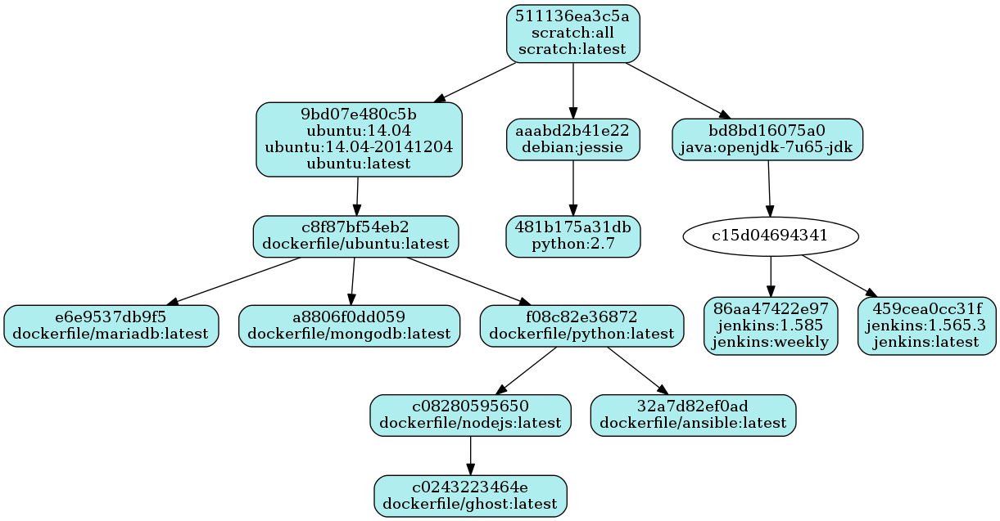
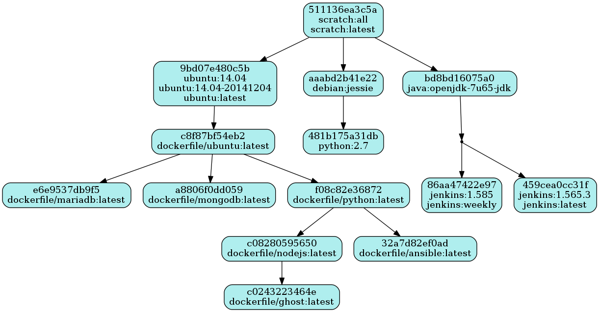
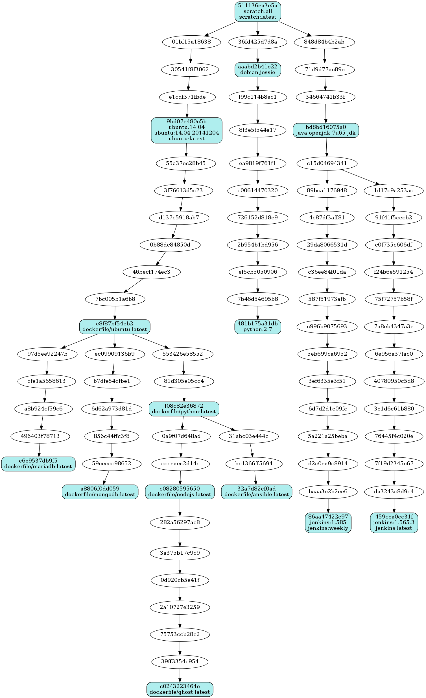
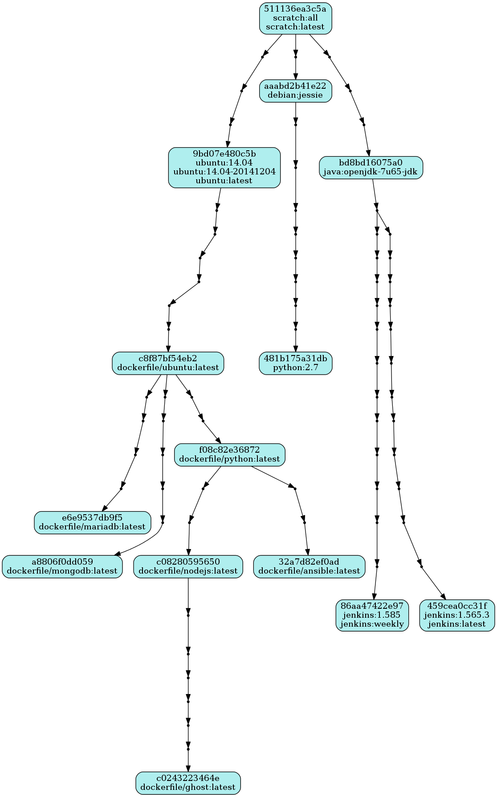

# dikki

Query docker informations. This tools aims to replace depecated `docker images --tree` dans deprecated `docker images --viz` as well as add more features to them.

* **project page** : https://github.com/gissehel/dikki
* **docker hub page** : https://registry.hub.docker.com/u/gissehel/dikki/

## help

```bash
$ dikki.py help --help
Usage: dikki.py [GLOBAL OPTIONS] COMMAND_NAME [OPTIONS] [VALUES]
Docker tool to query informations from images and containers

Commands:
    help                 give help                               
    images               Get docker images                       

Global options:
    --help               Get help on specific command            
                         (--help,-h)

images options:
    --all                Display all nodes                       
                         (--all,-a)
    --ascii              Display trees with ascii chars          
                         (--ascii,-A)
    --compact            Display trees with compact pattern      
                         (--compact,-c)
    --format=VALUE       Format for table and tree               
                         (--format,-f)
    --output=VALUE       Output the images as [tree|digraph|table|treetable]
                         (--output,-O)
    --point              Display non-important nodes as point in graphs
                         (--point,-p)
```

# Run inside a docker container

You can run this tool inside a docker container without installing it.

```
sudo docker run -it --rm -v /run/docker.sock:/var/run/docker.sock gissehel/dikki help
```

You can add an alias like :

```
alias dikki='sudo docker run -i --rm -v /run/docker.sock:/var/run/docker.sock gissehel/dikki'
```

and then use it like a classical application:

```
dikki help
```

# examples

All the examples use the same base of images.

## tree + all

```
$ sudo dikki.py images --output=tree --all
511136ea3c5a Virtual Size: 0 Tags: scratch:all, scratch:latest
├─01bf15a18638 Virtual Size: 192.48 MB
│ └─30541f8f3062 Virtual Size: 192.68 MB
│   └─e1cdf371fbde Virtual Size: 192.68 MB
│     └─9bd07e480c5b Virtual Size: 192.68 MB Tags: ubuntu:14.04, ubuntu:14.04-20141204, ubuntu:latest
│       └─55a37ec28b45 Virtual Size: 414.54 MB
│         └─3f76613d5c23 Virtual Size: 414.55 MB
│           └─d137c5918ab7 Virtual Size: 414.55 MB
│             └─0b88dc84850d Virtual Size: 414.63 MB
│               └─46becf174ec3 Virtual Size: 414.63 MB
│                 └─7bc005b1a6b8 Virtual Size: 414.63 MB
│                   └─c8f87bf54eb2 Virtual Size: 414.63 MB Tags: dockerfile/ubuntu:latest
│                     ├─97d5ee92247b Virtual Size: 666.35 MB
│                     │ └─cfe1a5658613 Virtual Size: 666.35 MB
│                     │   └─a8b924cf59c6 Virtual Size: 666.35 MB
│                     │     └─496403f78713 Virtual Size: 666.35 MB
│                     │       └─e6e9537db9f5 Virtual Size: 666.35 MB Tags: dockerfile/mariadb:latest
│                     ├─ec09909136b9 Virtual Size: 706.38 MB
│                     │ └─b7dfe54cfbe1 Virtual Size: 706.38 MB
│                     │   └─6d62a973d81d Virtual Size: 706.38 MB
│                     │     └─856c44ffc3f8 Virtual Size: 706.38 MB
│                     │       └─59ecccc98652 Virtual Size: 706.38 MB
│                     │         └─a8806f0dd059 Virtual Size: 706.38 MB Tags: dockerfile/mongodb:latest
│                     └─553426e58552 Virtual Size: 471.04 MB
│                       └─81d305e05cc4 Virtual Size: 471.04 MB
│                         └─f08c82e36872 Virtual Size: 471.04 MB Tags: dockerfile/python:latest
│                           ├─0a9f07d648ad Virtual Size: 496.30 MB
│                           │ └─ccceaca2d14c Virtual Size: 496.30 MB
│                           │   └─c08280595650 Virtual Size: 496.30 MB Tags: dockerfile/nodejs:latest
│                           │     └─282a56297ac8 Virtual Size: 573.02 MB
│                           │       └─3a375b17c9c9 Virtual Size: 573.02 MB
│                           │         └─0d920cb5e41f Virtual Size: 573.02 MB
│                           │           └─2a10727e3259 Virtual Size: 573.02 MB
│                           │             └─75753ccb28c2 Virtual Size: 573.02 MB
│                           │               └─39ff3354c954 Virtual Size: 573.02 MB
│                           │                 └─c0243223464e Virtual Size: 573.02 MB Tags: dockerfile/ghost:latest
│                           └─31abc03e444c Virtual Size: 482.98 MB
│                             └─bc1366ff5694 Virtual Size: 482.98 MB
│                               └─32a7d82ef0ad Virtual Size: 482.98 MB Tags: dockerfile/ansible:latest
├─36fd425d7d8a Virtual Size: 154.69 MB
│ └─aaabd2b41e22 Virtual Size: 154.69 MB Tags: debian:jessie
│   └─f99c114b8ec1 Virtual Size: 355.57 MB
│     └─8f3e5f544a17 Virtual Size: 387.57 MB
│       └─ea9819f761f1 Virtual Size: 747.95 MB
│         └─c00614470320 Virtual Size: 749.44 MB
│           └─726152d818e9 Virtual Size: 749.44 MB
│             └─2b954b1bd956 Virtual Size: 749.44 MB
│               └─ef5cb5050906 Virtual Size: 807.27 MB
│                 └─7b46d54695b8 Virtual Size: 812.64 MB
│                   └─481b175a31db Virtual Size: 812.64 MB Tags: python:2.7
└─848d84b4b2ab Virtual Size: 121.86 MB
  └─71d9d77ae89e Virtual Size: 121.86 MB
    └─34664741b33f Virtual Size: 121.86 MB
      └─bd8bd16075a0 Virtual Size: 562.78 MB Tags: java:openjdk-7u65-jdk
        └─c15d04694341 Virtual Size: 593.54 MB
          ├─89bca1176948 Virtual Size: 593.54 MB
          │ └─4c87df3aff81 Virtual Size: 593.54 MB
          │   └─29da8066531d Virtual Size: 593.88 MB
          │     └─c36ee84f01da Virtual Size: 593.88 MB
          │       └─587f51973afb Virtual Size: 661.82 MB
          │         └─c996b9075693 Virtual Size: 661.82 MB
          │           └─5eb699ca6952 Virtual Size: 661.82 MB
          │             └─3ef6335e3f51 Virtual Size: 661.82 MB
          │               └─6d7d2d1e09fc Virtual Size: 661.82 MB
          │                 └─5a221a25beba Virtual Size: 661.82 MB
          │                   └─d2c0ea9c8914 Virtual Size: 661.82 MB
          │                     └─baaa3c2b2ce6 Virtual Size: 661.82 MB
          │                       └─86aa47422e97 Virtual Size: 661.82 MB Tags: jenkins:1.585, jenkins:weekly
          └─1d17c9a253ac Virtual Size: 593.54 MB
            └─91f41f5cecb2 Virtual Size: 593.54 MB
              └─c0f735c606df Virtual Size: 593.88 MB
                └─f24b6e591254 Virtual Size: 593.88 MB
                  └─75f72757b58f Virtual Size: 661.74 MB
                    └─7a8eb4347a3e Virtual Size: 661.74 MB
                      └─6e956a37fac0 Virtual Size: 661.75 MB
                        └─40780950c5d8 Virtual Size: 661.75 MB
                          └─3e1d6e61b880 Virtual Size: 661.75 MB
                            └─76445f4c020e Virtual Size: 661.75 MB
                              └─7f19d2345e67 Virtual Size: 661.75 MB
                                └─da3243c8d9c4 Virtual Size: 661.75 MB
                                  └─459cea0cc31f Virtual Size: 661.75 MB Tags: jenkins:1.565.3, jenkins:latest
```

## tree

```
$ sudo dikki.py images -O tree
511136ea3c5a Virtual Size: 0 Tags: scratch:all, scratch:latest
├─9bd07e480c5b Virtual Size: 192.68 MB Tags: ubuntu:14.04, ubuntu:14.04-20141204, ubuntu:latest
│ └─c8f87bf54eb2 Virtual Size: 414.63 MB Tags: dockerfile/ubuntu:latest
│   ├─e6e9537db9f5 Virtual Size: 666.35 MB Tags: dockerfile/mariadb:latest
│   ├─a8806f0dd059 Virtual Size: 706.38 MB Tags: dockerfile/mongodb:latest
│   └─f08c82e36872 Virtual Size: 471.04 MB Tags: dockerfile/python:latest
│     ├─c08280595650 Virtual Size: 496.30 MB Tags: dockerfile/nodejs:latest
│     │ └─c0243223464e Virtual Size: 573.02 MB Tags: dockerfile/ghost:latest
│     └─32a7d82ef0ad Virtual Size: 482.98 MB Tags: dockerfile/ansible:latest
├─aaabd2b41e22 Virtual Size: 154.69 MB Tags: debian:jessie
│ └─481b175a31db Virtual Size: 812.64 MB Tags: python:2.7
└─bd8bd16075a0 Virtual Size: 562.78 MB Tags: java:openjdk-7u65-jdk
  └─c15d04694341 Virtual Size: 593.54 MB
    ├─86aa47422e97 Virtual Size: 661.82 MB Tags: jenkins:1.585, jenkins:weekly
    └─459cea0cc31f Virtual Size: 661.75 MB Tags: jenkins:1.565.3, jenkins:latest
```

## tree + compact

```
$ sudo dikki.py images -O tree --compact
511136ea3c5a  [ scratch:all scratch:latest ]
├─9bd07e480c5b  [ ubuntu:14.04 ubuntu:14.04-20141204 ubuntu:latest ]
│ └─c8f87bf54eb2  [ dockerfile/ubuntu:latest ]
│   ├─e6e9537db9f5  [ dockerfile/mariadb:latest ]
│   ├─a8806f0dd059  [ dockerfile/mongodb:latest ]
│   └─f08c82e36872  [ dockerfile/python:latest ]
│     ├─c08280595650  [ dockerfile/nodejs:latest ]
│     │ └─c0243223464e  [ dockerfile/ghost:latest ]
│     └─32a7d82ef0ad  [ dockerfile/ansible:latest ]
├─aaabd2b41e22  [ debian:jessie ]
│ └─481b175a31db  [ python:2.7 ]
└─bd8bd16075a0  [ java:openjdk-7u65-jdk ]
  └─c15d04694341
    ├─86aa47422e97  [ jenkins:1.585 jenkins:weekly ]
    └─459cea0cc31f  [ jenkins:1.565.3 jenkins:latest ]
```

## tree + compact + Ascii

```
$ sudo dikki.py images -O tree -c -A
511136ea3c5a  [ scratch:all scratch:latest ]
+-9bd07e480c5b  [ ubuntu:14.04 ubuntu:14.04-20141204 ubuntu:latest ]
| `-c8f87bf54eb2  [ dockerfile/ubuntu:latest ]
|   +-e6e9537db9f5  [ dockerfile/mariadb:latest ]
|   +-a8806f0dd059  [ dockerfile/mongodb:latest ]
|   `-f08c82e36872  [ dockerfile/python:latest ]
|     +-c08280595650  [ dockerfile/nodejs:latest ]
|     | `-c0243223464e  [ dockerfile/ghost:latest ]
|     `-32a7d82ef0ad  [ dockerfile/ansible:latest ]
+-aaabd2b41e22  [ debian:jessie ]
| `-481b175a31db  [ python:2.7 ]
`-bd8bd16075a0  [ java:openjdk-7u65-jdk ]
  `-c15d04694341
    +-86aa47422e97  [ jenkins:1.585 jenkins:weekly ]
    `-459cea0cc31f  [ jenkins:1.565.3 jenkins:latest ]
```

## (graph)

```
$ sudo dikki.py images
digraph docker {
 "511136ea3c5a" -> "9bd07e480c5b"
 "511136ea3c5a" -> "aaabd2b41e22"
 "511136ea3c5a" -> "bd8bd16075a0"
 "511136ea3c5a" [label="511136ea3c5a\nscratch:all\nscratch:latest",shape=box,fillcolor="paleturquoise",style="filled,rounded"];
 "9bd07e480c5b" -> "c8f87bf54eb2"
 "9bd07e480c5b" [label="9bd07e480c5b\nubuntu:14.04\nubuntu:14.04-20141204\nubuntu:latest",shape=box,fillcolor="paleturquoise",style="filled,rounded"];
 "c8f87bf54eb2" -> "e6e9537db9f5"
 "c8f87bf54eb2" -> "a8806f0dd059"
 "c8f87bf54eb2" -> "f08c82e36872"
 "c8f87bf54eb2" [label="c8f87bf54eb2\ndockerfile/ubuntu:latest",shape=box,fillcolor="paleturquoise",style="filled,rounded"];
 "e6e9537db9f5" [label="e6e9537db9f5\ndockerfile/mariadb:latest",shape=box,fillcolor="paleturquoise",style="filled,rounded"];
 "a8806f0dd059" [label="a8806f0dd059\ndockerfile/mongodb:latest",shape=box,fillcolor="paleturquoise",style="filled,rounded"];
 "f08c82e36872" -> "c08280595650"
 "f08c82e36872" -> "32a7d82ef0ad"
 "f08c82e36872" [label="f08c82e36872\ndockerfile/python:latest",shape=box,fillcolor="paleturquoise",style="filled,rounded"];
 "c08280595650" -> "c0243223464e"
 "c08280595650" [label="c08280595650\ndockerfile/nodejs:latest",shape=box,fillcolor="paleturquoise",style="filled,rounded"];
 "c0243223464e" [label="c0243223464e\ndockerfile/ghost:latest",shape=box,fillcolor="paleturquoise",style="filled,rounded"];
 "32a7d82ef0ad" [label="32a7d82ef0ad\ndockerfile/ansible:latest",shape=box,fillcolor="paleturquoise",style="filled,rounded"];
 "aaabd2b41e22" -> "481b175a31db"
 "aaabd2b41e22" [label="aaabd2b41e22\ndebian:jessie",shape=box,fillcolor="paleturquoise",style="filled,rounded"];
 "481b175a31db" [label="481b175a31db\npython:2.7",shape=box,fillcolor="paleturquoise",style="filled,rounded"];
 "bd8bd16075a0" -> "c15d04694341"
 "bd8bd16075a0" [label="bd8bd16075a0\njava:openjdk-7u65-jdk",shape=box,fillcolor="paleturquoise",style="filled,rounded"];
 "c15d04694341" -> "86aa47422e97"
 "c15d04694341" -> "459cea0cc31f"
 "86aa47422e97" [label="86aa47422e97\njenkins:1.585\njenkins:weekly",shape=box,fillcolor="paleturquoise",style="filled,rounded"];
 "459cea0cc31f" [label="459cea0cc31f\njenkins:1.565.3\njenkins:latest",shape=box,fillcolor="paleturquoise",style="filled,rounded"];
}
```



## (graph) + point

```
$ sudo dikki.py images --output=digraph -p | dot -Tpng > images.png
```



## (graph) + all

```
$ sudo dikki.py images -O digraph -a | dot -Tpng > images.png
```



## (graph) + point + all

```
$ sudo dikki.py images -O digraph -pa | dot -Tpng > images.png
```



## (table)

```
$ sudo dikki.py images -O table
id            tags                                              created              created      vsize      diffsize 
============  ================================================  ===================  ===========  =========  =========
511136ea3c5a  scratch:all scratch:latest                        2013-06-13 21:03:50  1 year ago   0          0        
9bd07e480c5b  ubuntu:14.04 ubuntu:14.04-20141204 ubuntu:latest  2014-12-04 17:58:31  9 days ago   192.68 MB  192.68 MB
c8f87bf54eb2  dockerfile/ubuntu:latest                          2014-12-05 05:59:38  9 days ago   414.63 MB  221.95 MB
e6e9537db9f5  dockerfile/mariadb:latest                         2014-12-05 06:36:35  9 days ago   666.35 MB  251.72 MB
a8806f0dd059  dockerfile/mongodb:latest                         2014-12-05 06:35:28  9 days ago   706.38 MB  291.76 MB
f08c82e36872  dockerfile/python:latest                          2014-12-05 06:34:29  9 days ago   471.04 MB  56.4 MB  
c08280595650  dockerfile/nodejs:latest                          2014-12-05 07:07:19  9 days ago   496.30 MB  25.3 MB  
c0243223464e  dockerfile/ghost:latest                           2014-12-05 07:19:31  9 days ago   573.02 MB  76.7 MB  
32a7d82ef0ad  dockerfile/ansible:latest                         2014-12-05 06:58:43  9 days ago   482.98 MB  11.9 MB  
aaabd2b41e22  debian:jessie                                     2014-11-06 20:43:04  37 days ago  154.69 MB  154.69 MB
481b175a31db  python:2.7                                        2014-11-26 22:30:48  17 days ago  812.64 MB  657.95 MB
bd8bd16075a0  java:openjdk-7u65-jdk                             2014-10-23 23:04:11  51 days ago  562.78 MB  562.78 MB
86aa47422e97  jenkins:1.585 jenkins:weekly                      2014-11-09 07:35:37  35 days ago  661.82 MB  68.3 MB  
459cea0cc31f  jenkins:1.565.3 jenkins:latest                    2014-11-09 07:35:19  35 days ago  661.75 MB  68.2 MB  
```

## (treetable)
```
$ # same as sudo dikki.py images -O treetable -f 'id/tags/created/createdrel#created/vsize/diffsize'
$ sudo dikki.py images -O treetable
id                      tags                                              created              created      vsize      diffsize 
======================  ================================================  ===================  ===========  =========  =========
511136ea3c5a            scratch:all scratch:latest                        2013-06-13 21:03:50  1 year ago   0          0        
├─9bd07e480c5b          ubuntu:14.04 ubuntu:14.04-20141204 ubuntu:latest  2014-12-04 17:58:31  9 days ago   192.68 MB  192.68 MB
│ └─c8f87bf54eb2        dockerfile/ubuntu:latest                          2014-12-05 05:59:38  9 days ago   414.63 MB  221.95 MB
│   ├─e6e9537db9f5      dockerfile/mariadb:latest                         2014-12-05 06:36:35  9 days ago   666.35 MB  251.72 MB
│   ├─a8806f0dd059      dockerfile/mongodb:latest                         2014-12-05 06:35:28  9 days ago   706.38 MB  291.76 MB
│   └─f08c82e36872      dockerfile/python:latest                          2014-12-05 06:34:29  9 days ago   471.04 MB  56.4 MB  
│     ├─c08280595650    dockerfile/nodejs:latest                          2014-12-05 07:07:19  9 days ago   496.30 MB  25.3 MB  
│     │ └─c0243223464e  dockerfile/ghost:latest                           2014-12-05 07:19:31  9 days ago   573.02 MB  76.7 MB  
│     └─32a7d82ef0ad    dockerfile/ansible:latest                         2014-12-05 06:58:43  9 days ago   482.98 MB  11.9 MB  
├─aaabd2b41e22          debian:jessie                                     2014-11-06 20:43:04  37 days ago  154.69 MB  154.69 MB
│ └─481b175a31db        python:2.7                                        2014-11-26 22:30:48  17 days ago  812.64 MB  657.95 MB
└─bd8bd16075a0          java:openjdk-7u65-jdk                             2014-10-23 23:04:11  51 days ago  562.78 MB  562.78 MB
  └─c15d04694341                                                          2014-10-23 23:09:39  51 days ago  593.54 MB  30.8 MB  
    ├─86aa47422e97      jenkins:1.585 jenkins:weekly                      2014-11-09 07:35:37  35 days ago  661.82 MB  68.3 MB  
    └─459cea0cc31f      jenkins:1.565.3 jenkins:latest                    2014-11-09 07:35:19  35 days ago  661.75 MB  68.2 MB  
```

## (treetable) + format
```
$ sudo dikki.py images -O treetable -f '"[ "createdrel" ]"#CREATED/tags< :: >#TAGS'
CREATED               TAGS                                                  
====================  ======================================================
[ 1 year ]            scratch:all :: scratch:latest                         
├─[ 9 days ]          ubuntu:14.04 :: ubuntu:14.04-20141204 :: ubuntu:latest
│ └─[ 9 days ]        dockerfile/ubuntu:latest                              
│   ├─[ 9 days ]      dockerfile/mariadb:latest                             
│   ├─[ 9 days ]      dockerfile/mongodb:latest                             
│   └─[ 9 days ]      dockerfile/python:latest                              
│     ├─[ 9 days ]    dockerfile/nodejs:latest                              
│     │ └─[ 9 days ]  dockerfile/ghost:latest                               
│     └─[ 9 days ]    dockerfile/ansible:latest                             
├─[ 37 days ]         debian:jessie                                         
│ └─[ 17 days ]       python:2.7                                            
└─[ 51 days ]         java:openjdk-7u65-jdk                                 
  └─[ 51 days ]                                                             
    ├─[ 35 days ]     jenkins:1.585 :: jenkins:weekly                       
    └─[ 35 days ]     jenkins:1.565.3 :: jenkins:latest                     
```

